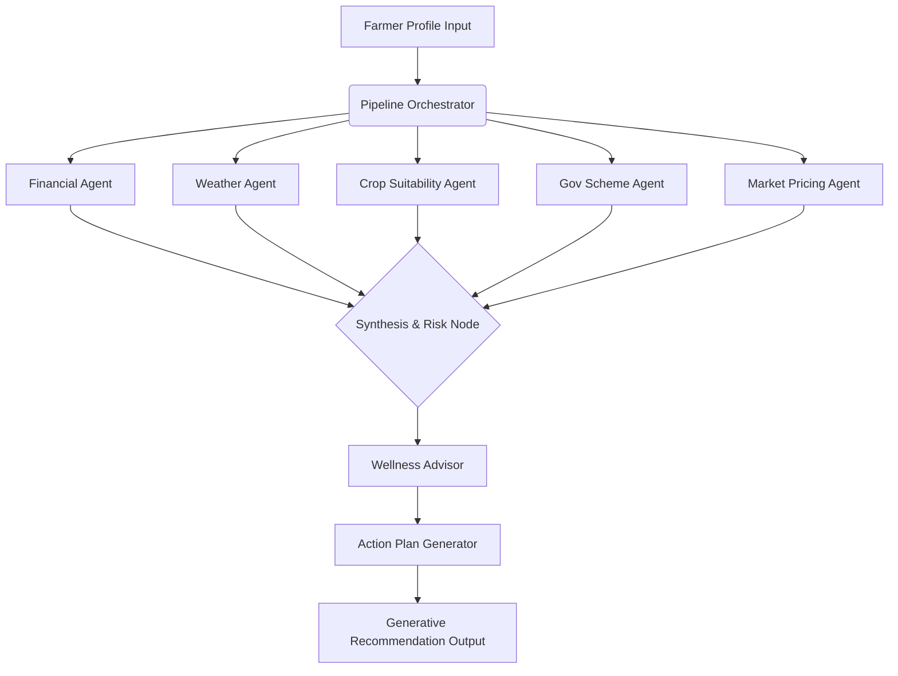

# KisanGPT Developer & Systems Architecture Guide

Welcome to the KisanGPT developer guide. This document provides detailed technical explanations of the AI Multi-Agent orchestration, API integrations, caching mechanisms, and testing workflows.

---

## 1. Multi-Agent DAG Orchestration

KisanGPT uses a custom orchestrator to run multiple specialized agents in parallel. The coordinator acts like a central router that manages dependencies and structures execution flows.



### Specialist Agent Responsibilities

1. **Financial Agent**: Computes debt-to-income metrics, credit defaults, and loan interest rates to assign a standard financial risk percentage.
2. **Weather Agent**: Resolves regional coordinates using OpenWeatherMap Geocoding, queries current conditions and 5-day precipitation forecasts, and logs risk thresholds (such as excessive rain, heatwaves, or frost warnings).
3. **Crop Suitability Agent**: Correlates soil composition (pH, clay, sandy, black soil) with crop types and historical local growth yields.
4. **Gov Scheme Agent**: Filters databases of agricultural subsidies (e.g., PM-KISAN, PMFBY) matching the farmer's land size and location.
5. **Market Pricing Agent**: Integrates real APMC mandi market commodity prices from Agmarknet API / Data.gov.in.

---

## 2. API Caching & Resilience

To ensure rapid dashboard loads and stay within rate limits, KisanGPT features a dual-layered caching system:

### A. In-Memory Cache
- Stores geocoded coordinates and active weather queries.
- Instantaneous retrieval for same-session page loads.

### B. MongoDB Persistent Cache
- Cached objects are written to MongoDB with a 15-minute Time-To-Live (TTL) index.
- If a query hits coordinate boxes within a 0.05 decimal threshold, the coordinate resolution is rounded and served directly from MongoDB cache, preventing duplicate API outbound rates.

### C. Graceful Fallbacks
- In the event of Gemini API limits, network timeouts, or quota exhaustion, agents automatically execute rule-based heuristic code blocks.
- This guarantees that the KisanGPT pipeline never crashes, maintaining 100% service availability.

---

## 3. High-Fidelity Demo Mode Hook

The frontend utilizes the `useDemoMode` client hook. When active:
- Replaces normal React Query network requests with data from `client/src/mock/demoData.js`.
- Bypasses production collections without database pollution.
- Persists read alerts state using a list of read IDs inside `localStorage`.

---

## 4. Execution & Testing

### Running Tests
Execute the comprehensive test suites located in `server/tests/`:
```bash
# Weather integration & geocoding cache test
npm run test:weather

# APMC market Agmarknet API validation
npm run test:market
```

### Docker Deployments
To spin up all nodes (MongoDB, Express Server, Vite SPA) concurrently:
```bash
docker compose up --build
```
The client serves on `http://localhost:80` and the server listens on `http://localhost:5000`.
